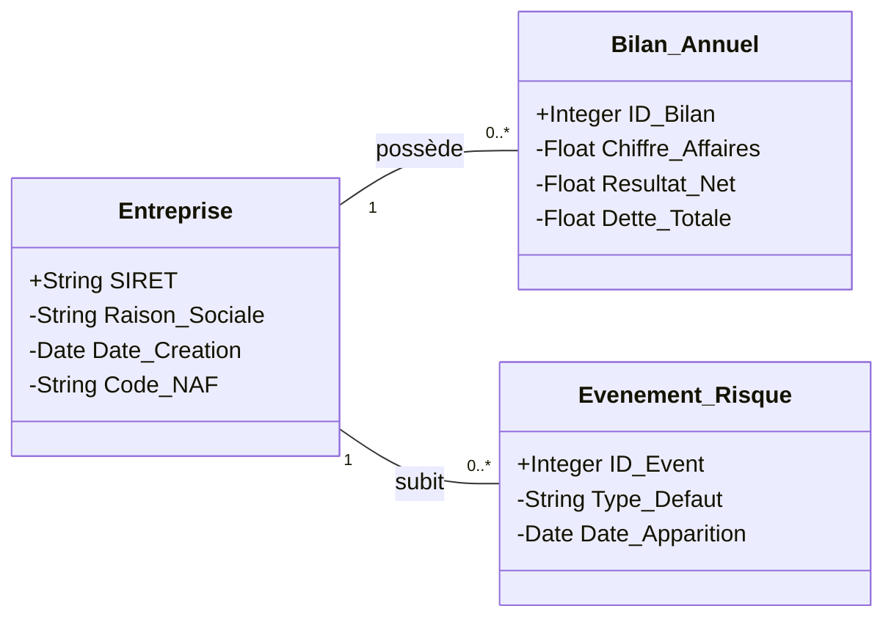

# 📉 Business Risk Scoring - Prédiction de Défaillance

Ce projet est une solution complète de Data Science permettant d'analyser et de prédire le risque de défaillance des entreprises. Il combine une phase d'exploration de données (EDA), une modélisation poussée via XGBoost et une interface interactive Streamlit.

## 🚀 Structure du Projet

* **src/business-risk/** : Application Streamlit (Dashboard interactif).
* **src/model/** : Notebooks de modélisation (Baseline, XGBoost v1 à v3).
* **src/eda/** : Analyse exploratoire des données.
* **src/uml/** : Modélisation des données.

## 📊 Modèle de Données

Voici comment les données sont structurées pour l'analyse de risque :



## 🛠️ Installation et Utilisation

### 1. Cloner le projet
```bash
git clone [https://github.com/Djohell13/business-risk-scoring.git](https://github.com/Djohell13/business-risk-scoring.git)
cd business-risk-scoring
```

### 20 Lancer le projet Streamlit
```bash
cd src/business-risk
pip install -r requirements.txt
streamlit run app.py
``` 

🧠 Méthodologie

* Exploration : Analyse de la firmographie et des secteurs d'activité.

* Modélisation : Utilisation de XGBoost avec optimisation des hyperparamètres.

* Visualisation : Dashboard multipages (Firmographie, Analyse territoriale, Projections à 3 ans).

Auteur : Joël Termondjian